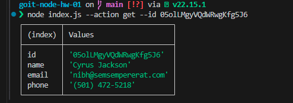

# Contacts CLI Project

Simple Node.js CLI app to manage contacts: list, get by id, add, remove.

## Usage

Run commands with:

```bash
node index.js --action list

node index.js --action get --id <contactId>

node index.js --action add --name <name> --email <email> --phone <phone>

node index.js --action remove --id <contactId>
```

## Screenshots





